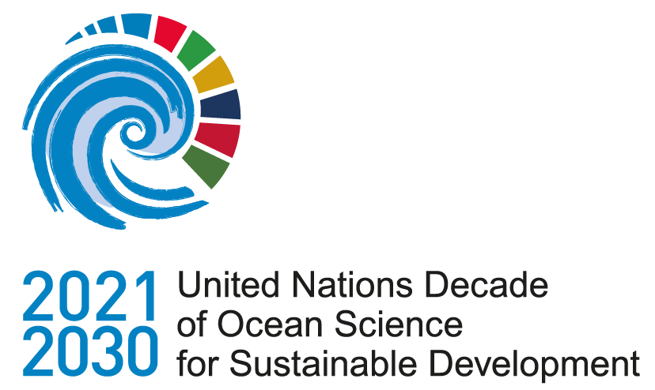
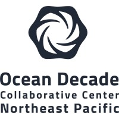

    
    &nbsp;&nbsp;&nbsp;&nbsp;
    
    &nbsp;&nbsp;&nbsp;&nbsp;
    
    &nbsp;&nbsp;&nbsp;&nbsp;
    

# dataset-title

Summary here

## Method

Description of the methodology

## Reports

Any link to reports associated with this dataset. The reports can be made available
within this same repository.

## Resources

See the data dictionary file for a complete description of data variables, units
and descriptions.

Link to any associated resources:

- Data Management Plan
- External Data Repositories
- Publications
